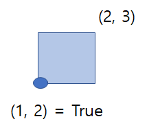

### 풀이 개념

직사각형의 면적을 구한다 = 직사각형이 차지하는 1x1 크기의 칸들을 하나 하나 색칠한다는 생각으로 접근한다. xy 좌표 평면을 2차원 리스트로 선언한 후, 직사각형이 접근하는 좌표들을 True로 바꿔주며 색칠한다.

예시) 1x1 크기의 직사각형이 색칠되어있다.

아래와 같이 (1, 2) 부터 (2, 3)까지 1x1 크기의 정사각형이 색칠되어 있다는 것은, (1, 2)의 값이 True 라는 것을 뜻한다.



이러한 방법으로, (x1, y1) 부터 (x2, y2)까지 있는 직사각형을 색칠한다고 하면 2차원 리스트는 아래와 같다.


### 풀이

1. 입력 조건에 있는 1 ≤ x, y ≤ 100 를 참고하여, xy 좌표평면을 구현할 2차원 리스트를 선언한다.(False로 초기화)
2. 색칠하는 면적을 카운트할 변수 area = 0 선언
3. 입력 값을 받고 색칠 시작!
4. x1 ~ x2 for문, y1 ~ y2 for문을 통해 1x1 사각형을 일일이 색칠한다.(False를 True로 바꾸기)
5. 이 때, 색칠되는 면적(True로 바꾸는 갯수)만큼 area를 증가시킨다.
6. 만약 이미 색칠되어 있다면(이미 True라면) 건너뛴다.
7. 마지막으로 색칠된 면적(area)을 return한다.


### 코드

```python
xy_map = [[False for x in range(101)] for y in range(101)]

area = 0
for cnt in range(4):
    x1, y1, x2, y2 = map(int, input().split())
    for i in range(x1, x2):
        for j in range(y1, y2):
            if xy_map[i][j]: continue
            
            area += 1
            xy_map[i][j] = True

print(area)
```


### 참고자료

1. 리스트 for문으로 초기화하기(파이썬 공식 문서)

   [5. Data Structures - Python 3.9.6 documentation](https://docs.python.org/ko/3/tutorial/datastructures.html#list-comprehensions)

2. map 함수로 입력 받기(코딩 도장)

   [파이썬 코딩 도장](https://dojang.io/mod/page/view.php?id=2179)