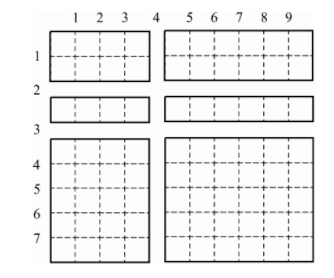

### 풀이 개념

종이가 잘려있는 순서대로 리스트를 만들어보자.

> 예시)
>
> 
>
> 세로 리스트 = [0, 2, 3, 8]
> 가로 리스트 = [0, 4, 10]

이 때, 가장 큰 종이의 넓이는 '가장 긴 세로길이 * 가장 긴 가로길이' 이다.
위 처럼 리스트를 만들고 오름차순으로 sort한 후, list[idx] - list[idx - 1]의 길이가 가장 긴 경우를 찾아 곱하는 방식으로 구현한다.


### 풀이

1. 가로 세로길이를 width, height 변수에 저장한다.
2. 자르는 내용들을 리스트로 저장하기 위해 cuts 리스트를 생성한다.
3. 맨 처음 인덱스는 0으로 시작하므로, 0을 미리 넣어놓는다.
4. cuts에 각 자르는 내용들을 넣는다.
5. 맨 마지막 인덱스인 가로&세로길이를 추가한 후 정렬!
6. list[idx] - [idx-1]를 통해 세로길이를 구하며 최댓값을 찾는다.
7. 가로길이도 마찬가지 방법으로 찾는다.
8. 최대 세로 * 가로 세로 = 최대넓이


### 코드

```python
width, height = map(int, input().split())

cuts = [[0], [0]]
n = int(input())
for i in range(n):
    cut_direction, idx = map(int, input().split())
    cuts[cut_direction].append(idx)

cuts[0].append(height)
cuts[1].append(width)

cuts[0].sort()
cuts[1].sort()

max_height = 0
max_width = 0
for idx in range(1, len(cuts[0])):
    h = cuts[0][idx] - cuts[0][idx - 1]
    if max_height < h:
        max_height = h

for idx in range(1, len(cuts[1])):
    w = cuts[1][idx] - cuts[1][idx - 1]
    if max_width < w:
        max_width = w

print(max_height * max_width)
```


### 참고자료

없음
